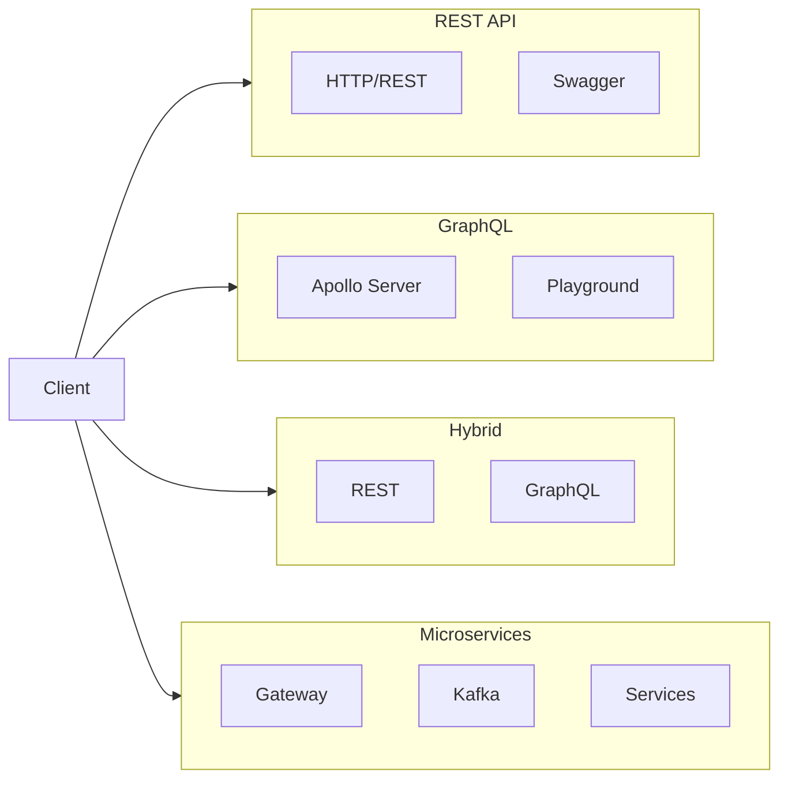
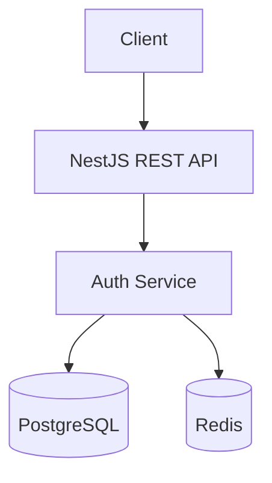
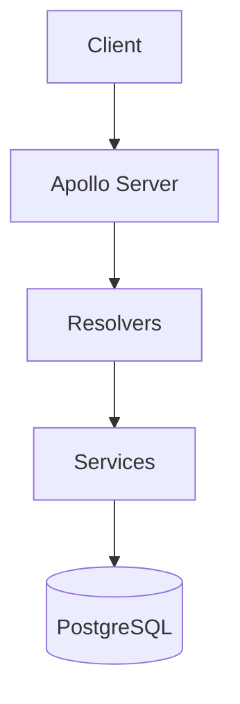
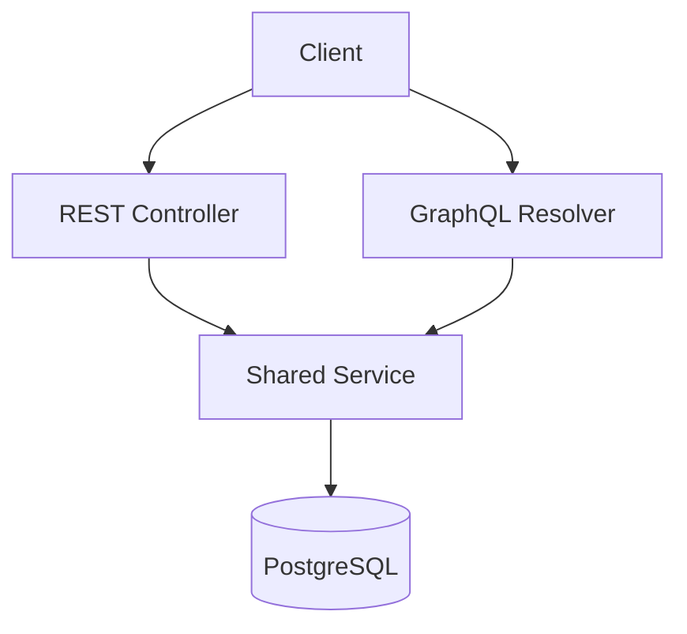
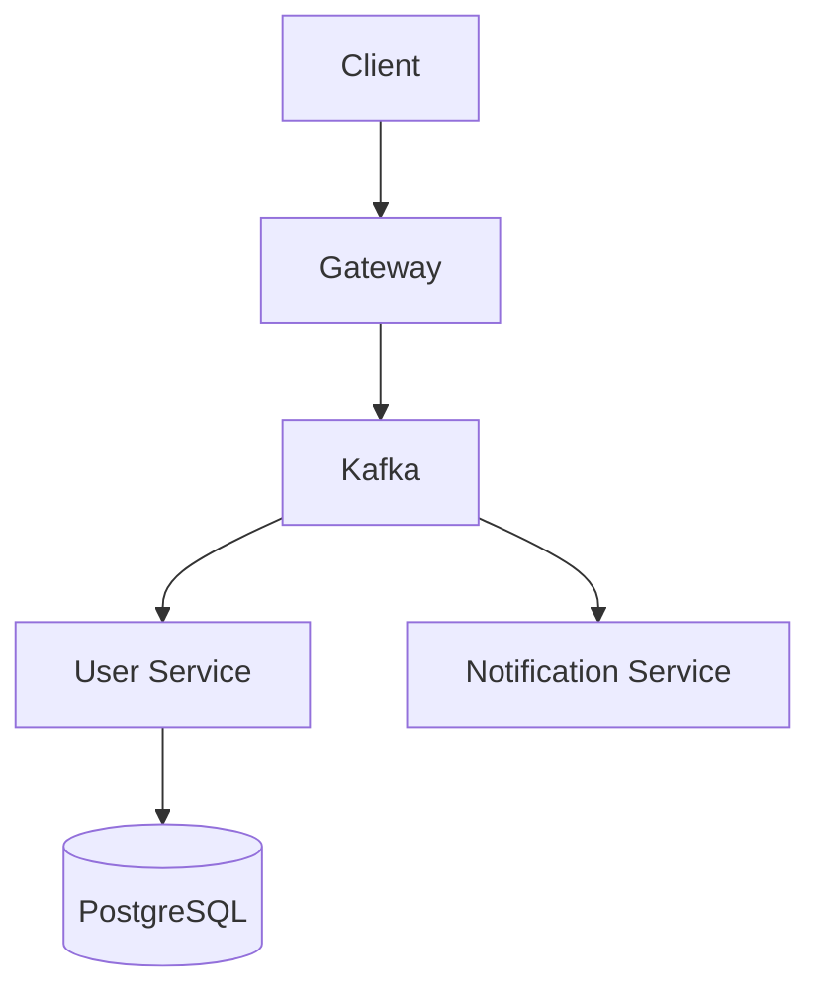
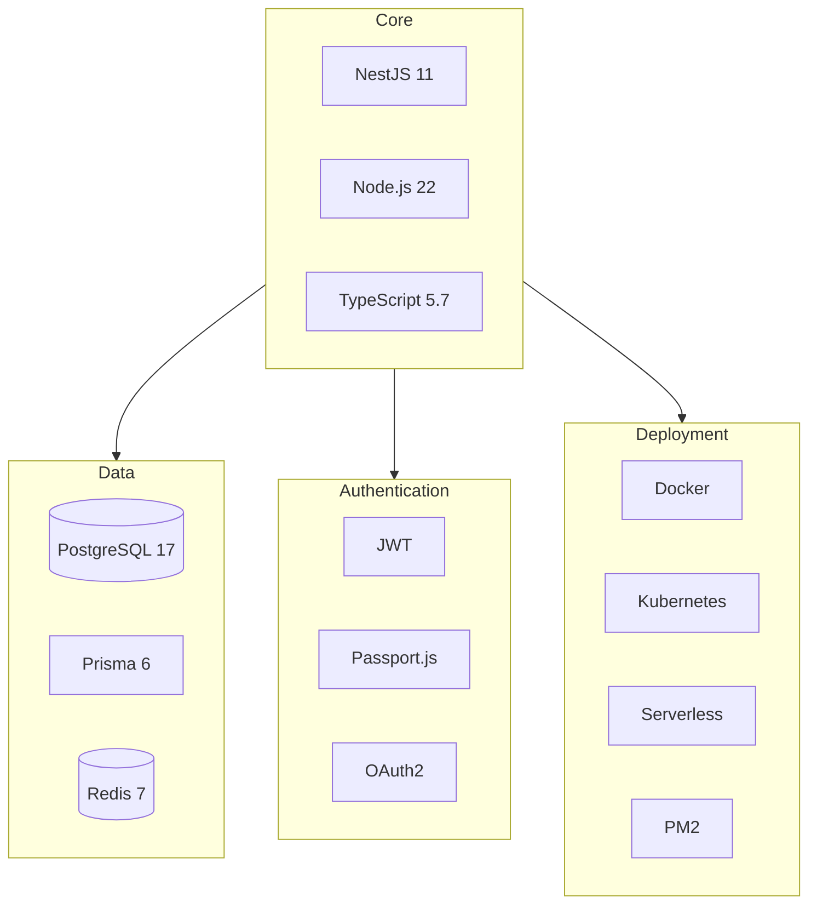

# NestJS Templates

Production-ready NestJS 11 templates for rapid project scaffolding.

## Template Comparison



## Architecture Overview

### REST API Template



### GraphQL Template



### Hybrid Template



### Microservices Template



## Templates

| Template | API Style | Best For |
|----------|-----------|----------|
| [`rest-api/`](./rest-api/) | REST + Swagger | Traditional REST APIs, CRUD apps |
| [`graphql/`](./graphql/) | GraphQL | Mobile apps, flexible queries |
| [`hybrid/`](./hybrid/) | REST + GraphQL | APIs serving multiple clients |
| [`microservices/`](./microservices/) | Kafka messaging | Distributed systems, scalability |

## Feature Matrix

| Feature | REST | GraphQL | Hybrid | Microservices |
|---------|:----:|:-------:|:------:|:-------------:|
| NestJS 11 | ✓ | ✓ | ✓ | ✓ |
| PostgreSQL | ✓ | ✓ | ✓ | ✓ |
| Prisma ORM | ✓ | ✓ | ✓ | ✓ |
| JWT Auth | ✓ | ✓ | ✓ | ✓ |
| OAuth2 | ✓ | ✓ | ✓ | - |
| Redis Cache | ✓ | ✓ | ✓ | ✓ |
| Rate Limiting | ✓ | ✓ | ✓ | ✓ |
| Swagger | ✓ | - | ✓ | ✓ |
| GraphQL Playground | - | ✓ | ✓ | - |
| Kafka | - | - | - | ✓ |
| Docker | ✓ | ✓ | ✓ | ✓ |
| Kubernetes | ✓ | ✓ | ✓ | ✓ |
| Serverless | ✓ | ✓ | ✓ | - |
| PM2 | ✓ | ✓ | ✓ | - |

## Quick Start

```bash
# Clone this repo
git clone git@github.com:knguyen30111/be-template.git

# Copy the template you need
cp -r be-template/rest-api my-new-project
cd my-new-project

# Install & run
pnpm install
cp .env.example .env
pnpm db:generate
pnpm start:dev
```

## Tech Stack



## Template Details

### REST API (`rest-api/`)

- Traditional controller/service pattern
- Swagger/OpenAPI documentation
- Standard HTTP methods (GET, POST, PUT, DELETE)
- Auth + Health modules

**Best for:** CRUD APIs, admin dashboards, traditional web apps

### GraphQL (`graphql/`)

- Schema-first approach with Apollo Server
- GraphQL Playground for testing
- Resolver pattern with GQL guards
- Auto-generated TypeScript types

**Best for:** Mobile apps, SPAs, apps needing flexible data fetching

### Hybrid (`hybrid/`)

- Both REST endpoints AND GraphQL resolvers
- Swagger + GraphQL Playground
- Shared services between REST/GraphQL
- Single codebase, dual API styles

**Best for:** APIs serving web (REST) and mobile (GraphQL) clients

### Microservices (`microservices/`)

- Kafka transport layer for messaging
- Gateway + User Service + Notification Service
- Per-service Docker & K8s configs
- NestJS monorepo structure

**Best for:** Large-scale apps, team-based development, high scalability needs

## Deployment Options

Each template includes deployment configs for:

| Target | Files | Use Case |
|--------|-------|----------|
| Docker | `docker/Dockerfile`, `docker-compose.yml` | Local dev, containers |
| Kubernetes | `k8s/` manifests | Production, scalability |
| Serverless | `serverless.yml` | Google Cloud Functions |
| VPS | `pm2.ecosystem.config.js` | Traditional servers |

## Documentation

Each template includes:
- `README.md` - Quick start, API reference
- `docs/system-architecture.md` - Architecture diagrams
- `docs/deployment-guide.md` - Deployment instructions

## License

MIT
