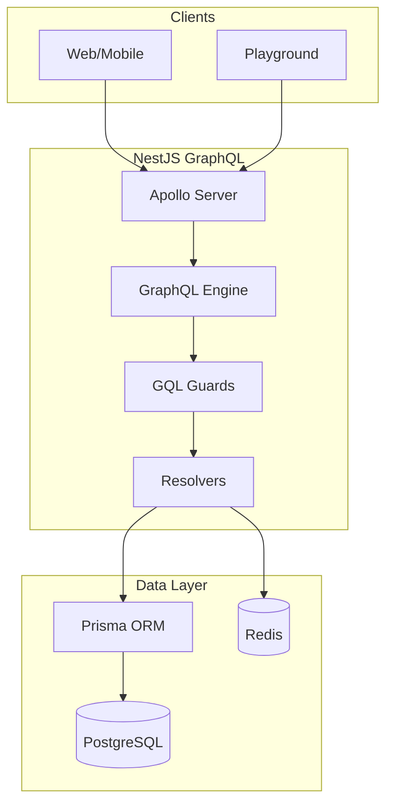
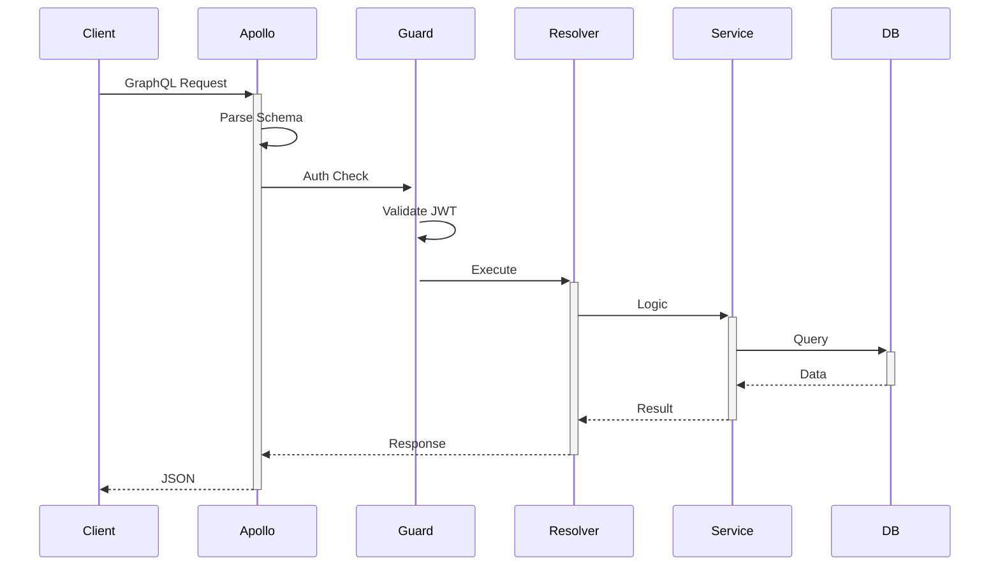
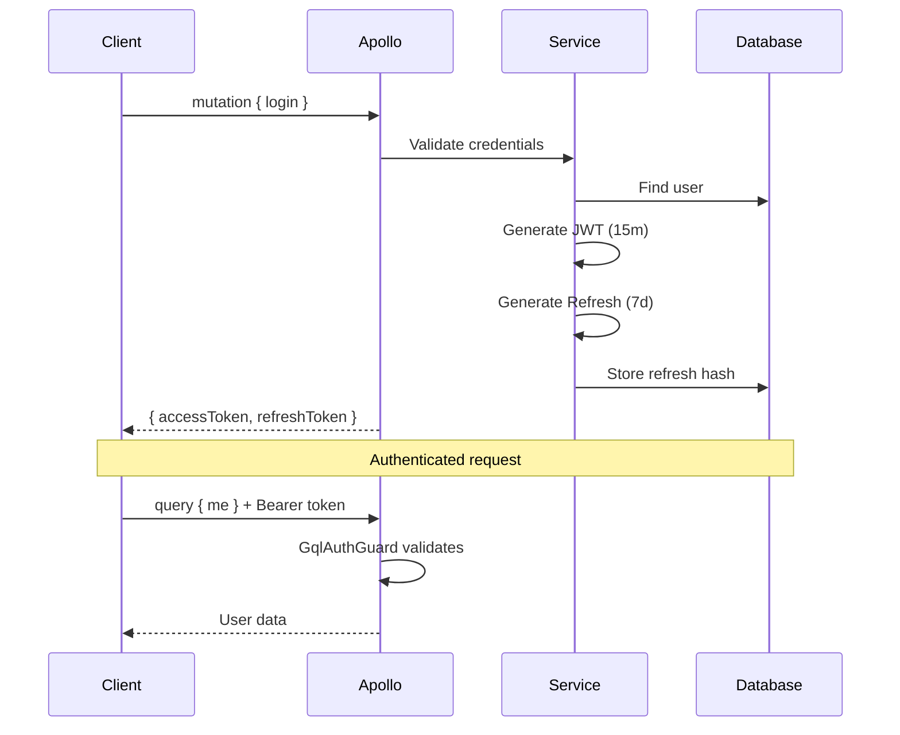
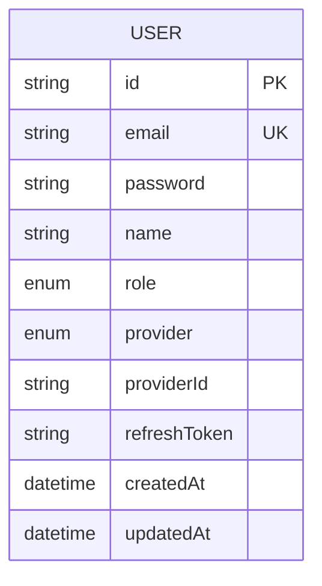

# NestJS GraphQL Template

Production-ready NestJS GraphQL API with schema-first approach, JWT authentication, and multi-target deployment.

## Architecture



## Request Flow



## Features

- **NestJS 11** + Node.js 22
- **GraphQL**: Apollo Server 5 (schema-first)
- **Auth**: JWT + OAuth2 (Google, GitHub)
- **Database**: PostgreSQL + Prisma ORM
- **Cache**: Redis
- **Security**: Helmet, rate limiting
- **Testing**: Vitest + Supertest
- **Deploy**: Docker, K8s, Serverless, PM2

## Quick Start

```bash
pnpm install
cp .env.example .env
docker compose up -d postgres redis
pnpm db:push
pnpm start:dev
```

GraphQL Playground: http://localhost:3000/graphql

## Project Structure

```
src/
├── config/              # Configuration
├── graphql/
│   └── schema.graphql   # Schema definition
├── modules/
│   ├── auth/            # Resolvers, guards, strategies
│   ├── health/          # Health resolver
│   └── prisma/          # Database service
├── common/              # Shared utilities
└── main.ts
```

## GraphQL Operations

### Queries

```graphql
# Health check
query { health }

# Current user (auth required)
query { me { id email name } }

# Get user by ID
query { user(id: "...") { id email } }
```

### Mutations

```graphql
# Register
mutation {
  register(input: { email: "...", password: "...", name: "..." }) {
    accessToken
    user { id email }
  }
}

# Login
mutation {
  login(input: { email: "...", password: "..." }) {
    accessToken
    refreshToken
  }
}

# Refresh tokens
mutation { refreshTokens { accessToken refreshToken } }

# Logout
mutation { logout }
```

## Authentication



## Database Schema



## Deployment

### Docker

```bash
docker build -f docker/Dockerfile -t api .
docker compose up -d
```

### Kubernetes

```bash
kubectl apply -f k8s/
```

### Serverless

```bash
npx serverless deploy --stage prod
```

### PM2

```bash
pnpm build && pm2 start pm2.ecosystem.config.js
```

## Scripts

```bash
pnpm start:dev      # Dev server
pnpm build          # Production build
pnpm test           # Tests
pnpm db:generate    # Generate Prisma
pnpm db:push        # Push schema
```

## Documentation

- [System Architecture](./docs/system-architecture.md)
- [Deployment Guide](./docs/deployment-guide.md)

## License

MIT
