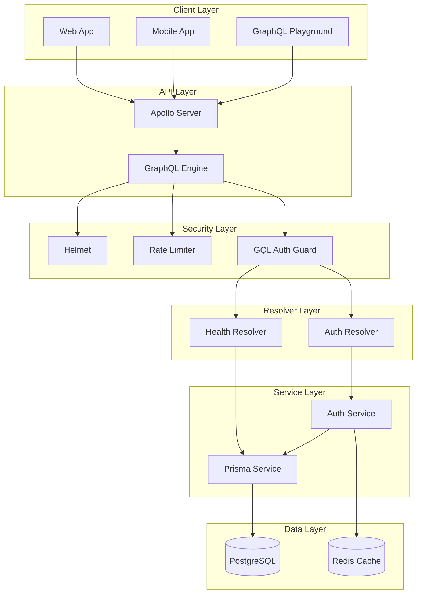
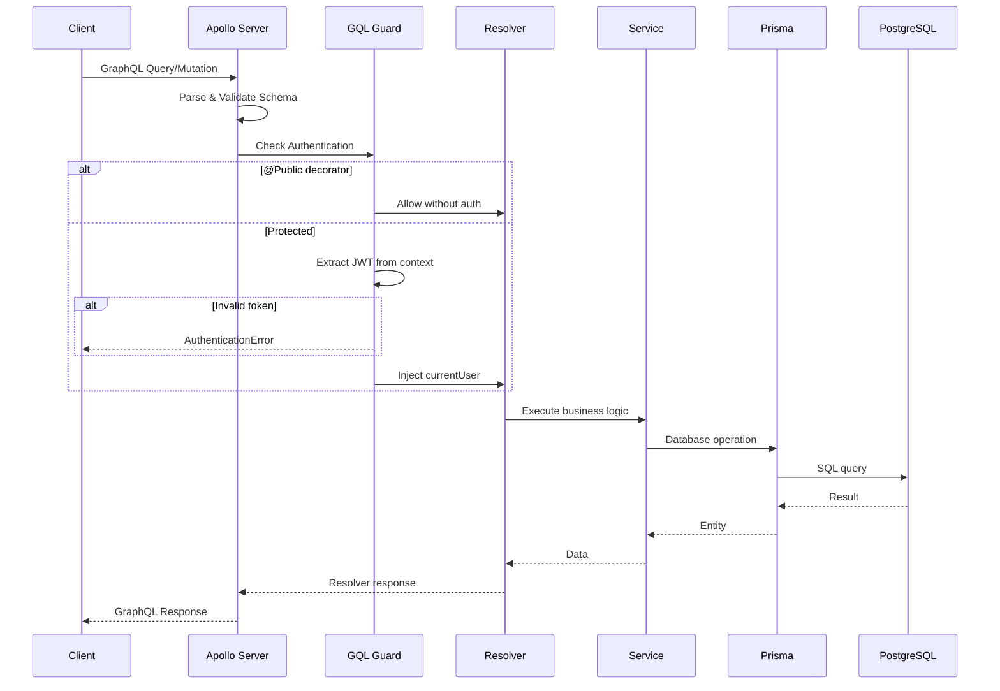
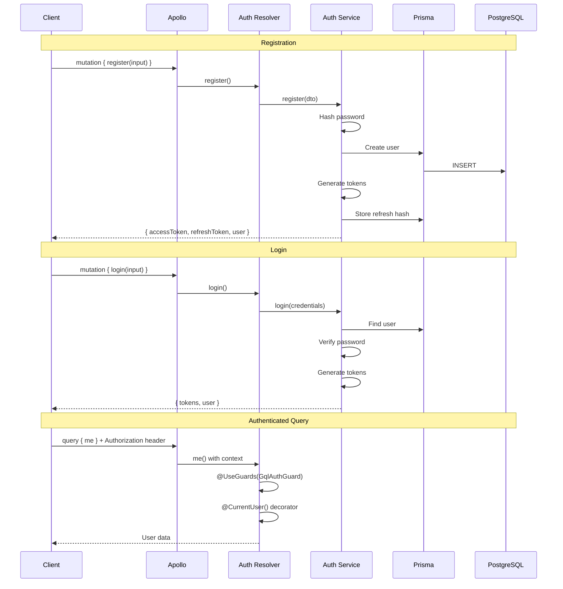
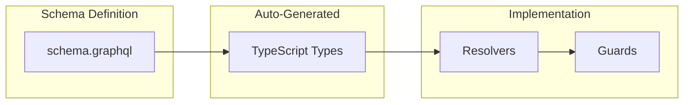
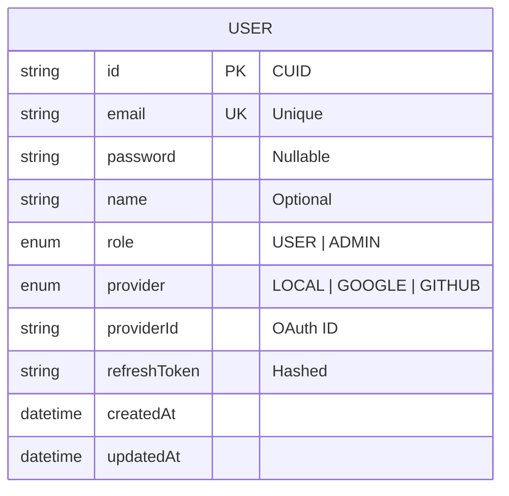
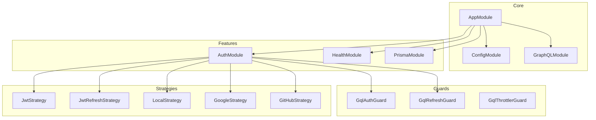
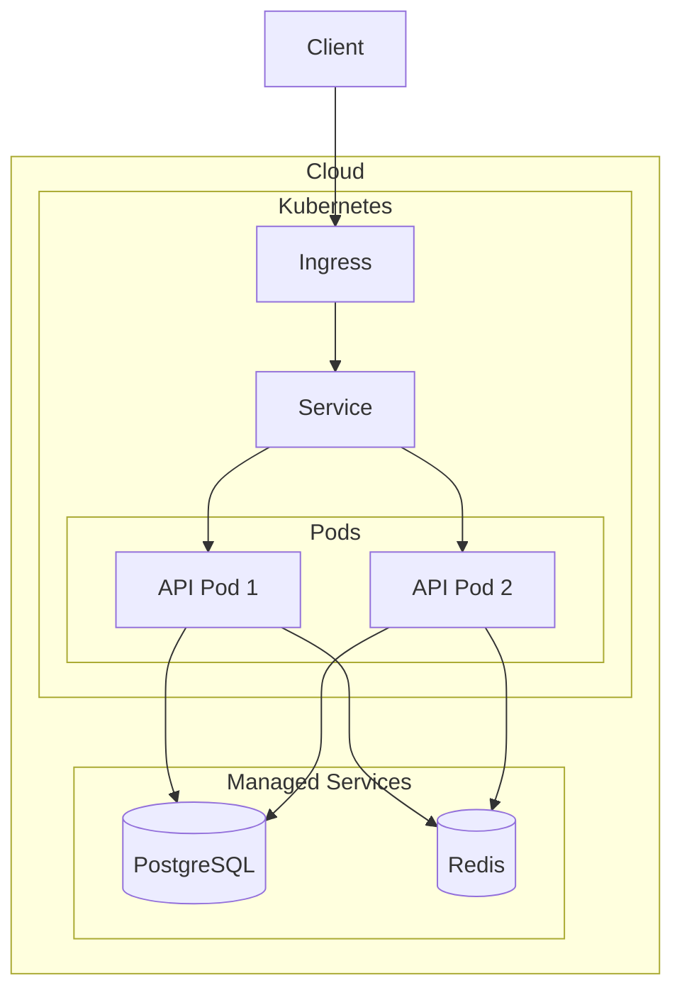

# System Architecture

## High-Level Architecture

## GraphQL Request Flow

## Authentication Flow

## Schema-First Architecture

## Database Schema

## Module Dependencies

## Deployment Architecture

## Component Overview

| Component | Technology | Purpose |
|-----------|------------|---------|
| Framework | NestJS 11 | Application framework |
| GraphQL | Apollo Server 5 | GraphQL engine |
| Schema | Schema-first | Type definitions |
| Runtime | Node.js 22 | JavaScript runtime |
| Database | PostgreSQL 17 | Primary data store |
| ORM | Prisma 6 | Database abstraction |
| Cache | Redis 7 | Session & cache |
| Auth | Passport.js | Authentication |
| Testing | Vitest | Unit & E2E tests |

## Security Layers

1. **Helmet** - HTTP security headers (CSP adjusted for Apollo)
2. **GqlThrottlerGuard** - GraphQL rate limiting
3. **GqlAuthGuard** - JWT authentication
4. **bcrypt** - Password hashing
5. **ValidationPipe** - Input validation
