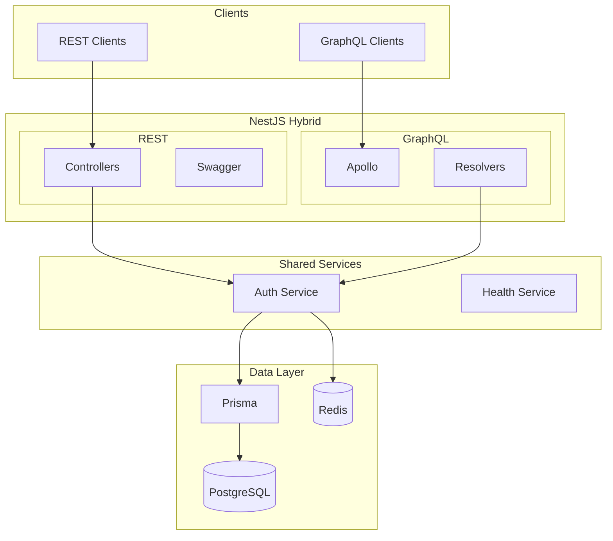
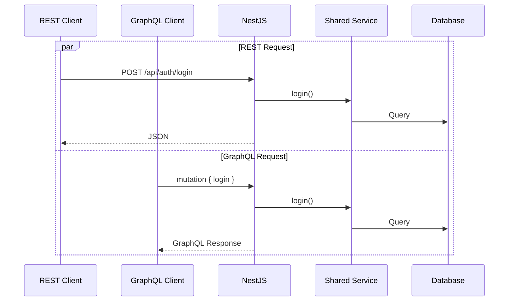
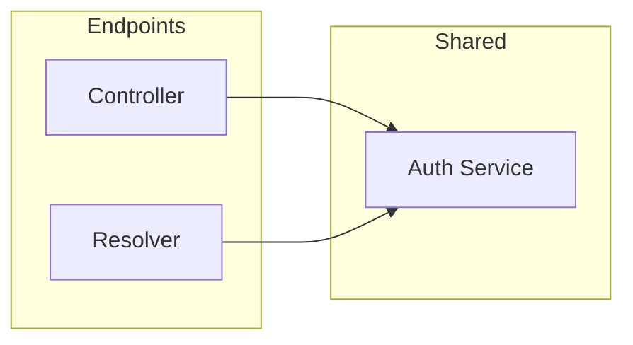
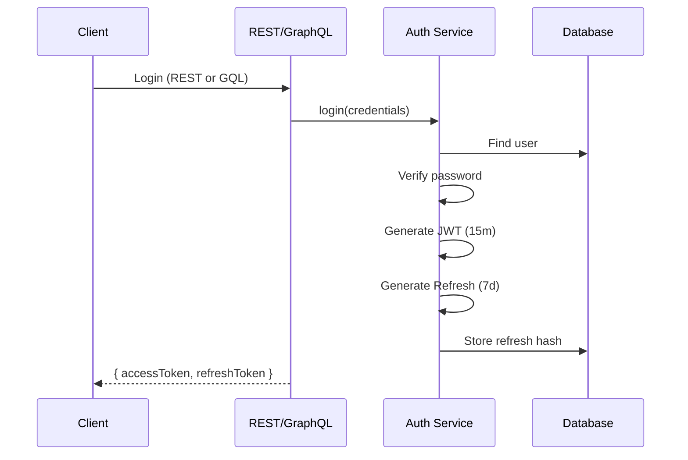
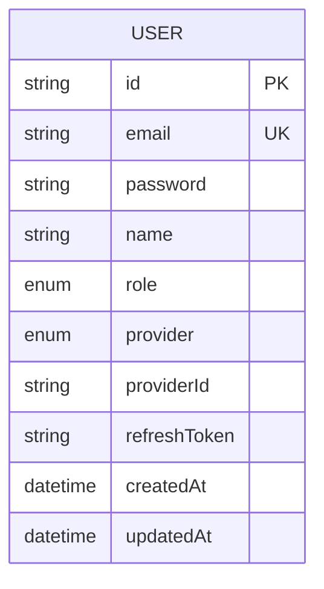

# NestJS Hybrid Template

Production-ready NestJS Hybrid API combining REST and GraphQL with shared services.

## Architecture



## Request Flows



## Features

- **NestJS 11** + Node.js 22
- **Hybrid**: REST + GraphQL (schema-first)
- **Auth**: JWT + OAuth2 (Google, GitHub)
- **Database**: PostgreSQL + Prisma ORM
- **Cache**: Redis
- **Docs**: Swagger + GraphQL Playground
- **Testing**: Vitest + Supertest
- **Deploy**: Docker, K8s, Serverless, PM2

## Quick Start

```bash
pnpm install
cp .env.example .env
docker compose up -d postgres redis
pnpm db:push
pnpm start:dev
```

### Endpoints

- **REST API**: http://localhost:3000/api/v1/
- **Swagger**: http://localhost:3000/api/docs
- **GraphQL**: http://localhost:3000/graphql

## Project Structure

```
src/
├── config/              # Configuration
├── graphql/
│   └── schema.graphql   # GraphQL schema
├── modules/
│   ├── auth/
│   │   ├── auth.controller.ts  # REST
│   │   ├── auth.resolver.ts    # GraphQL
│   │   └── auth.service.ts     # Shared
│   ├── health/          # Health checks
│   └── prisma/          # Database
├── common/              # Guards, decorators
└── main.ts
```

## REST Endpoints

| Method | Endpoint | Auth | Description |
|--------|----------|------|-------------|
| POST | /api/v1/auth/register | - | Register |
| POST | /api/v1/auth/login | - | Login |
| POST | /api/v1/auth/refresh | JWT | Refresh |
| POST | /api/v1/auth/logout | JWT | Logout |
| GET | /api/v1/auth/me | JWT | Current user |
| GET | /api/v1/health | - | Health check |

## GraphQL Operations

```graphql
# Mutations
mutation { register(input: {...}) { accessToken user { id } } }
mutation { login(input: {...}) { accessToken refreshToken } }
mutation { refreshTokens { accessToken refreshToken } }
mutation { logout }

# Queries
query { me { id email name } }
query { user(id: "...") { id email } }
query { health }
```

## Shared Service Pattern



Both REST and GraphQL share the same service layer for:
- Authentication logic
- Token generation
- Password hashing
- User management

## Authentication



## Database Schema



## Deployment

### Docker

```bash
docker build -f docker/Dockerfile -t api .
docker compose up -d
```

### Kubernetes

```bash
kubectl apply -f k8s/
```

### Serverless

```bash
npx serverless deploy --stage prod
```

### PM2

```bash
pnpm build && pm2 start pm2.ecosystem.config.js
```

## Scripts

```bash
pnpm start:dev      # Dev server
pnpm build          # Production build
pnpm test           # Tests
pnpm db:generate    # Generate Prisma
pnpm db:migrate     # Run migrations
```

## Documentation

- [System Architecture](./docs/system-architecture.md)
- [Deployment Guide](./docs/deployment-guide.md)

## License

MIT
