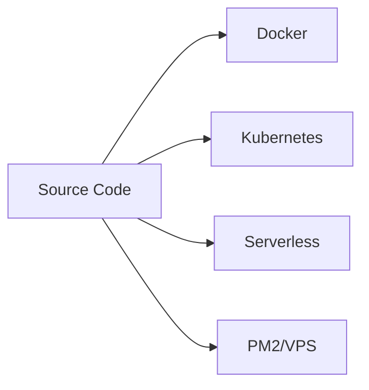
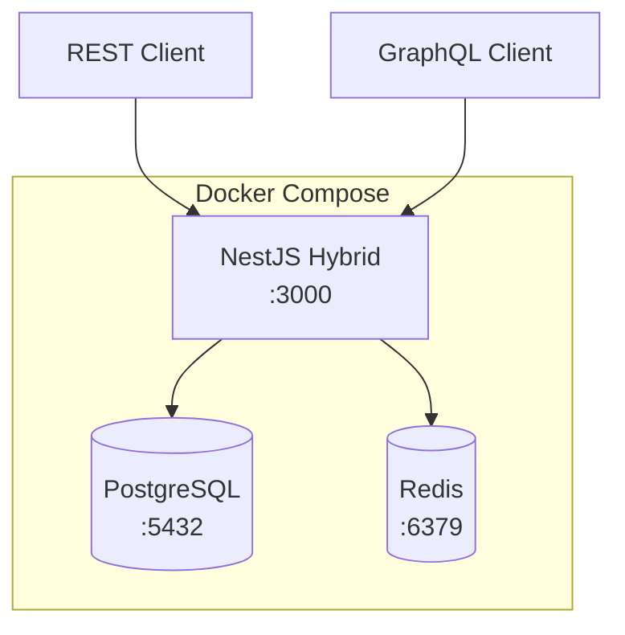
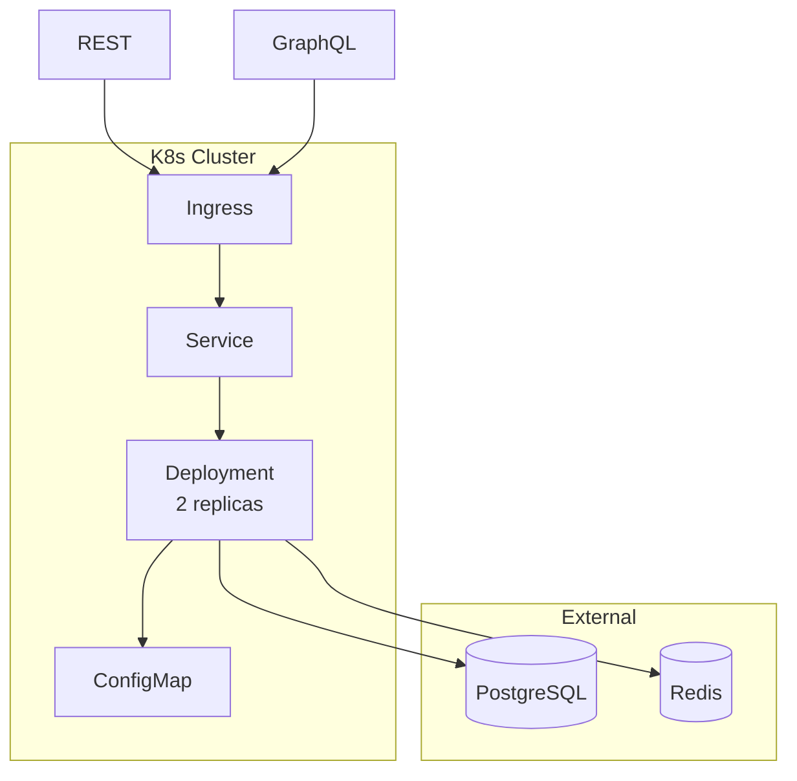
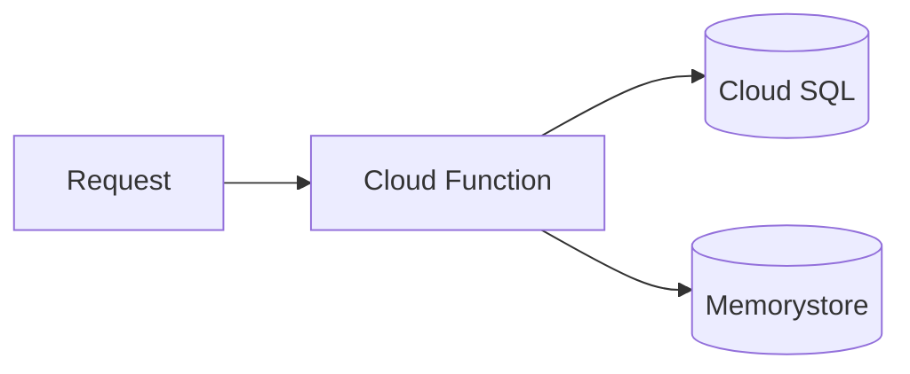
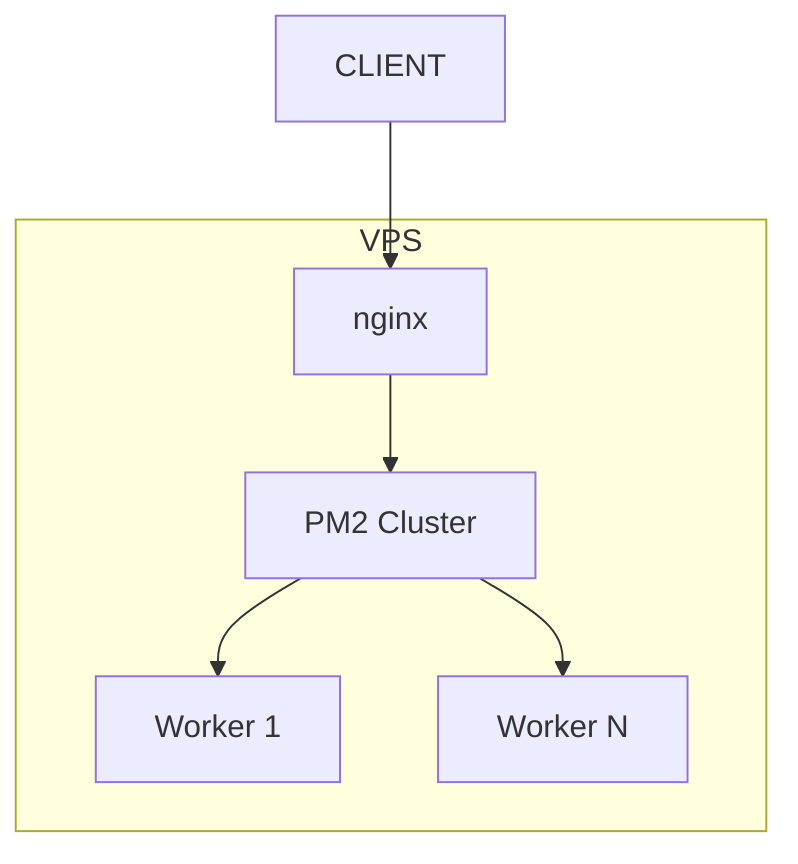

# Deployment Guide

## Deployment Options



## Docker Deployment

### Architecture



### Build & Run

```bash
# Production build
docker build -f docker/Dockerfile -t hybrid-api .

# Run stack
docker compose up -d

# View logs
docker compose logs -f api
```

## Kubernetes Deployment

### Architecture



### Deploy

```bash
kubectl apply -f k8s/
kubectl get pods -l app=hybrid-api
```

### Resources

| Resource | Request | Limit |
|----------|---------|-------|
| CPU | 100m | 500m |
| Memory | 128Mi | 512Mi |

### Endpoints

| Type | Path | Description |
|------|------|-------------|
| REST | /api/* | REST endpoints |
| Swagger | /api/docs | REST documentation |
| GraphQL | /graphql | GraphQL endpoint |

## Serverless (GCP)



```bash
npx serverless deploy --stage prod
```

## PM2 Deployment



```bash
pnpm build
pm2 start pm2.ecosystem.config.js --env production
```

## Environment Variables

| Variable | Required | Description |
|----------|----------|-------------|
| NODE_ENV | Yes | Environment |
| PORT | Yes | Server port |
| API_PREFIX | Yes | REST prefix (api) |
| DATABASE_URL | Yes | PostgreSQL |
| REDIS_URL | Yes | Redis |
| JWT_ACCESS_SECRET | Yes | JWT key |
| JWT_REFRESH_SECRET | Yes | Refresh key |
| SWAGGER_ENABLED | No | Enable Swagger |
