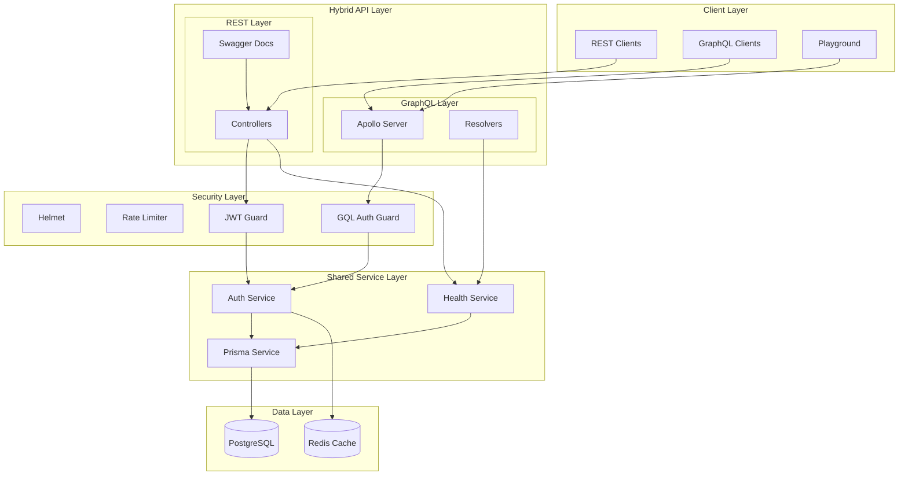
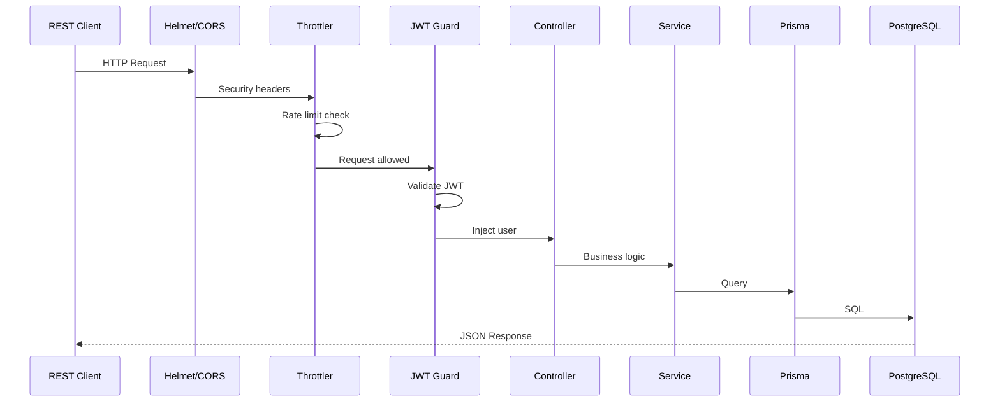
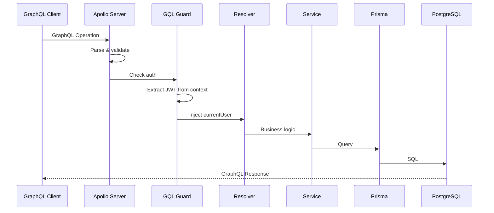
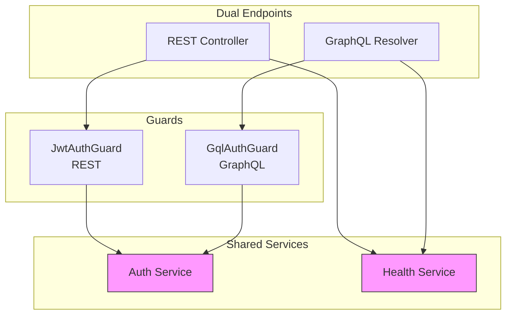
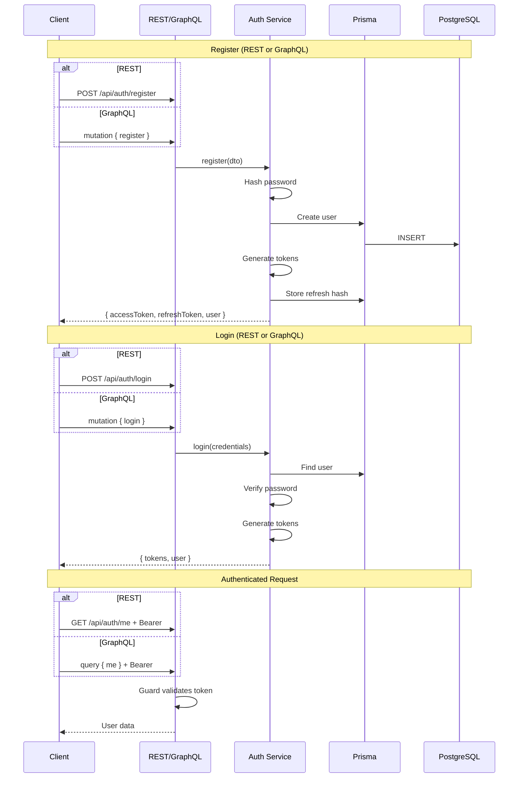
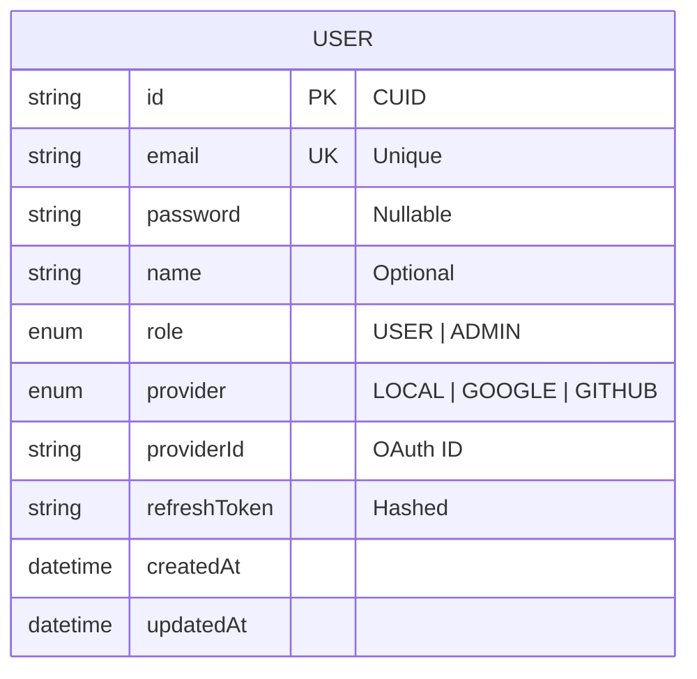
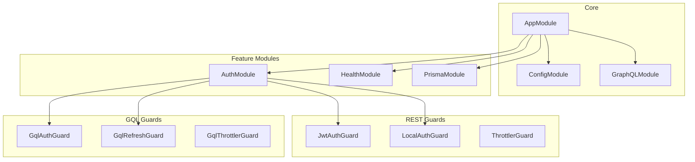
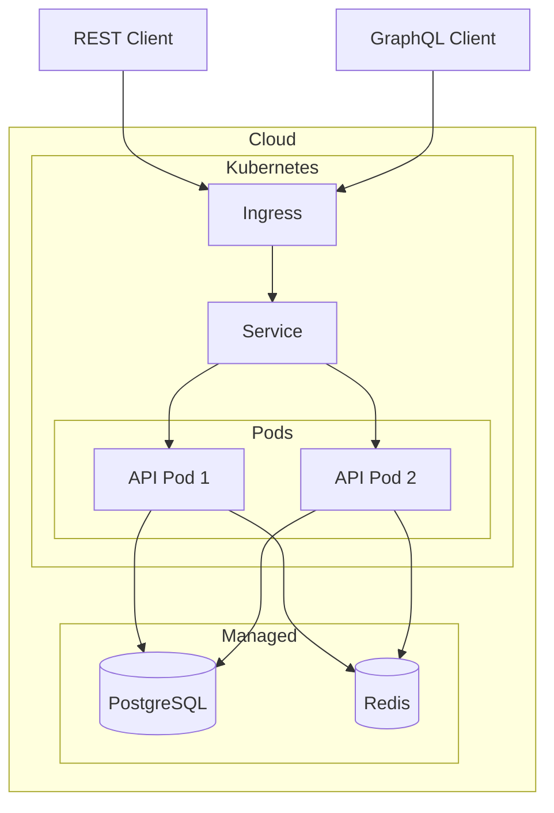

# System Architecture

## High-Level Architecture

## Hybrid Request Flows

### REST Request Flow

### GraphQL Request Flow

## Shared Service Architecture

## Authentication Flow

## Database Schema

## Module Dependencies

## Deployment Architecture

## Component Overview

| Component | Technology | Purpose |
|-----------|------------|---------|
| Framework | NestJS 11 | Application framework |
| REST | Controllers | HTTP endpoints |
| GraphQL | Apollo Server 5 | GraphQL engine |
| Runtime | Node.js 22 | JavaScript runtime |
| Database | PostgreSQL 17 | Primary data store |
| ORM | Prisma 6 | Database abstraction |
| Cache | Redis 7 | Session & cache |
| Auth | Passport.js | Authentication |
| REST Docs | Swagger | API documentation |
| GQL Docs | Playground | GraphQL explorer |
| Testing | Vitest | Unit & E2E tests |

## Security Layers

1. **Helmet** - HTTP security headers
2. **CORS** - Cross-origin control
3. **ThrottlerGuard** - REST rate limiting
4. **GqlThrottlerGuard** - GraphQL rate limiting
5. **JwtAuthGuard** - REST JWT auth
6. **GqlAuthGuard** - GraphQL JWT auth
7. **bcrypt** - Password hashing
8. **ValidationPipe** - Input validation
