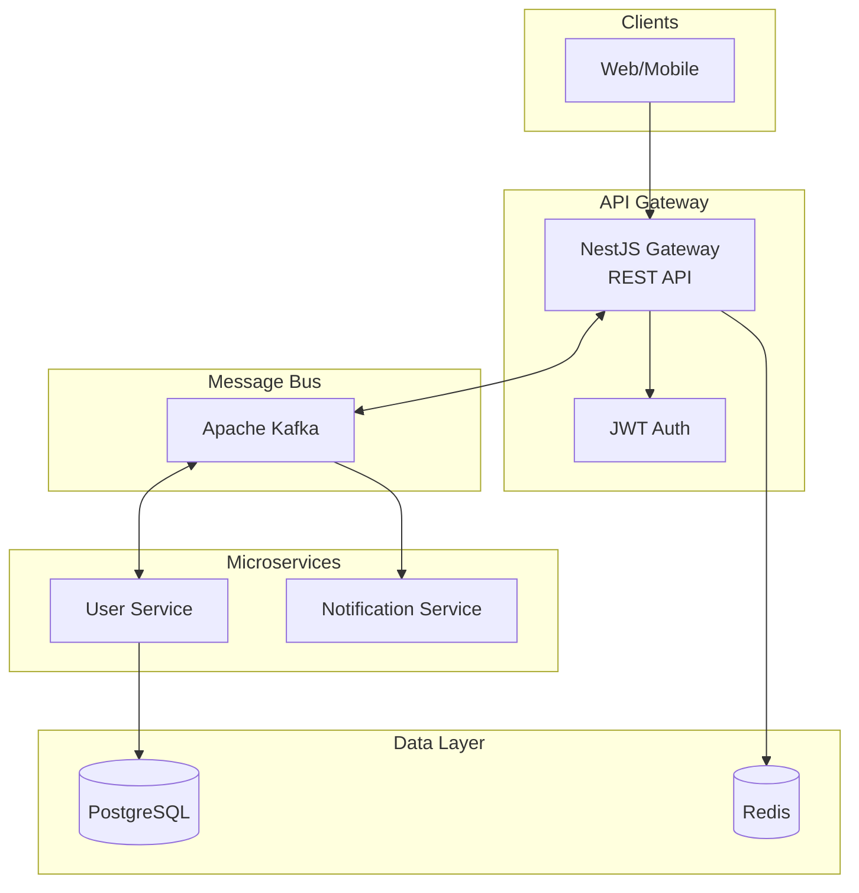
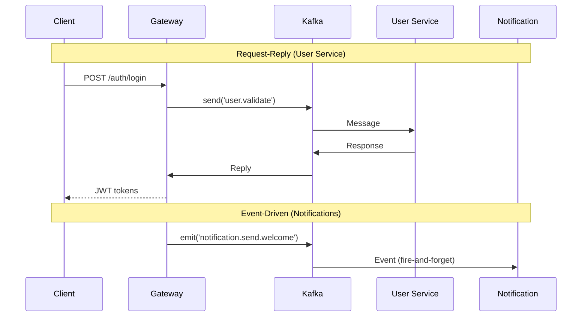
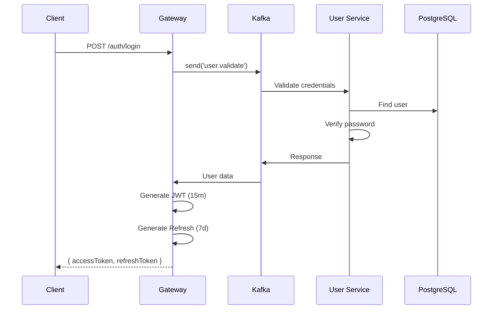
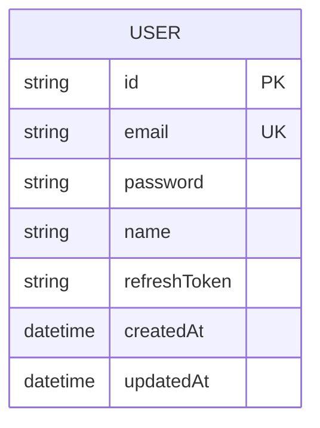

# NestJS Microservices Template

Production-ready NestJS microservices with Kafka messaging, JWT authentication, and Kubernetes deployment.

## Architecture



## Communication Patterns



## Services

| Service | Role | Transport |
|---------|------|-----------|
| **Gateway** | HTTP API, JWT auth, routing | HTTP → Kafka |
| **User Service** | User CRUD, validation | Kafka consumer |
| **Notification Service** | Email/SMS | Kafka events |

## Tech Stack

- **NestJS 11** + Node.js 22
- **Kafka** (kafkajs) for messaging
- **PostgreSQL 17** + Prisma ORM
- **Redis 7** for caching
- **JWT** + Passport authentication
- **Docker** + Kubernetes

## Quick Start

```bash
# Install dependencies
pnpm install

# Setup environment
cp .env.example .env

# Start infrastructure
docker compose up -d postgres redis kafka zookeeper

# Generate Prisma client
pnpm db:generate

# Run migrations
pnpm db:migrate

# Start all services
pnpm start:all
```

Gateway: http://localhost:3000/api/v1/
Swagger: http://localhost:3000/api/docs

## Project Structure

```
├── apps/
│   ├── gateway/          # HTTP API entry point
│   ├── user-service/     # User microservice
│   └── notification-service/  # Notification microservice
├── libs/
│   └── shared/           # Shared interfaces & constants
├── prisma/               # Database schema
├── docker/               # Dockerfiles
├── k8s/                  # Kubernetes manifests
└── docker-compose.yml
```

## API Endpoints

| Method | Endpoint | Auth | Description |
|--------|----------|------|-------------|
| POST | /api/v1/auth/register | - | Register user |
| POST | /api/v1/auth/login | - | Login |
| POST | /api/v1/auth/refresh | JWT | Refresh tokens |
| GET | /api/v1/auth/profile | JWT | Current user |
| GET | /health | - | Health check |

## Authentication Flow



## Kafka Topics

| Topic | Pattern | Service |
|-------|---------|---------|
| `user.register` | Request-Reply | User Service |
| `user.validate` | Request-Reply | User Service |
| `user.find` | Request-Reply | User Service |
| `notification.send.email` | Event | Notification |
| `notification.send.welcome` | Event | Notification |

## Database Schema



## Development

```bash
# Start individual services
pnpm start:gateway
pnpm start:user-service
pnpm start:notification-service

# Run tests
pnpm test

# Lint & format
pnpm lint
pnpm format
```

## Deployment

### Docker Compose

```bash
# Build and run all
docker compose up -d

# View logs
docker compose logs -f
```

### Kubernetes

```bash
# Apply namespace and configs
kubectl apply -f k8s/namespace.yaml
kubectl apply -f k8s/configmap.yaml

# Create secrets
cp k8s/secrets.example.yaml k8s/secrets.yaml
# Edit with real values
kubectl apply -f k8s/secrets.yaml

# Deploy services
kubectl apply -f k8s/gateway/
kubectl apply -f k8s/user-service/
kubectl apply -f k8s/notification-service/
```

## Service Communication

### Request-Reply Pattern

```typescript
// Gateway sends, waits for response
this.userClient.send('user.validate', credentials);

// User Service handles with @MessagePattern
@MessagePattern('user.validate')
async validate(data) { ... }
```

### Event-Driven Pattern

```typescript
// Gateway emits, no response expected
this.notificationClient.emit('notification.send.welcome', { userId });

// Notification Service handles with @EventPattern
@EventPattern('notification.send.welcome')
async handleWelcome(data) { ... }
```

## Environment Variables

| Variable | Service | Description |
|----------|---------|-------------|
| PORT | Gateway | Server port (3000) |
| KAFKA_BROKERS | All | Kafka connection |
| DATABASE_URL | User | PostgreSQL connection |
| REDIS_URL | Gateway | Redis connection |
| JWT_ACCESS_SECRET | Gateway | JWT signing key |
| JWT_REFRESH_SECRET | Gateway | Refresh token key |

## Documentation

- [System Architecture](./docs/system-architecture.md)
- [Deployment Guide](./docs/deployment-guide.md)

## License

MIT
