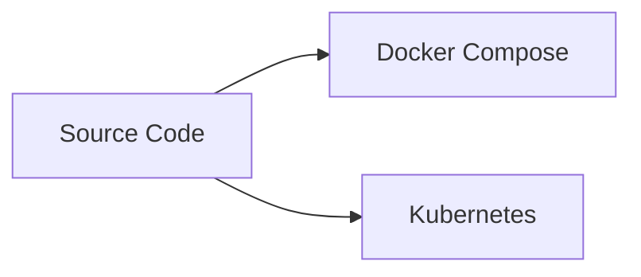
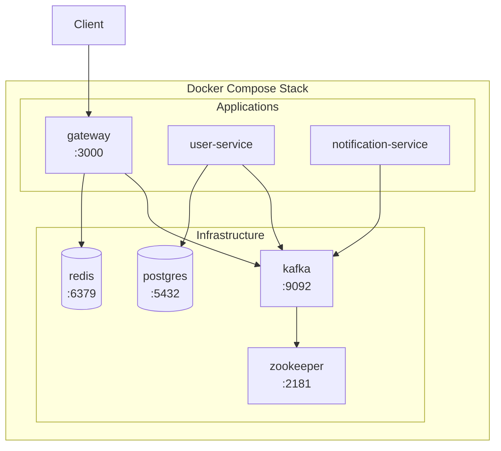
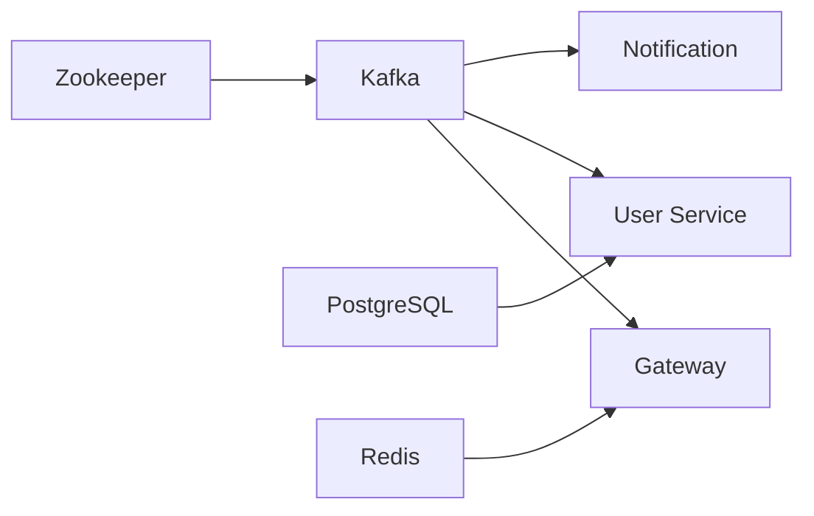
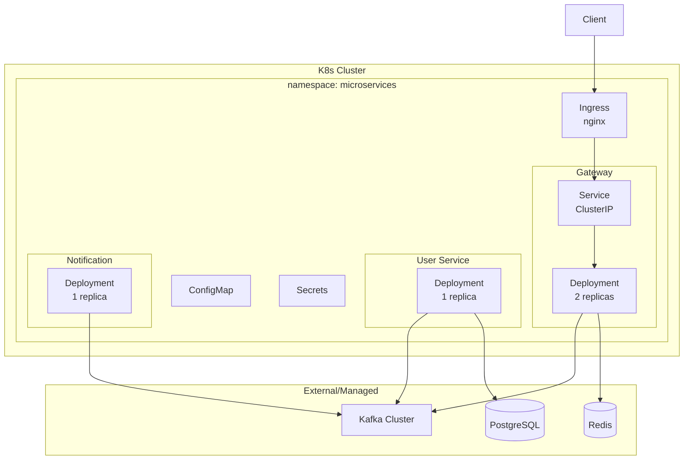
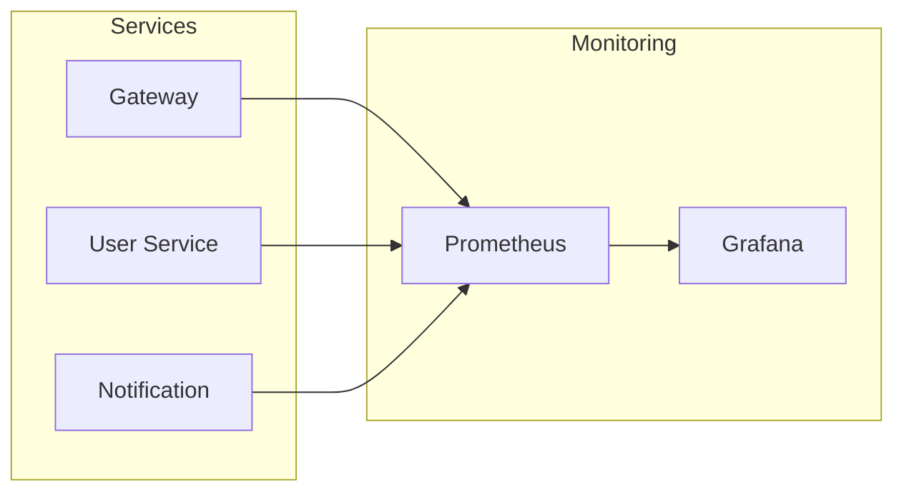

# Deployment Guide

## Deployment Options



## Docker Compose Deployment

### Architecture



### Service Dependencies



### Startup Order

| Order | Service | Depends On |
|-------|---------|------------|
| 1 | postgres | - |
| 2 | redis | - |
| 3 | zookeeper | - |
| 4 | kafka | zookeeper (healthy) |
| 5 | user-service | kafka, postgres (healthy) |
| 6 | notification-service | kafka (healthy) |
| 7 | gateway | kafka, redis (healthy) |

### Commands

```bash
# Start infrastructure
docker compose up -d postgres redis zookeeper kafka

# Wait for healthy, then start apps
docker compose up -d

# View all logs
docker compose logs -f

# View specific service
docker compose logs -f gateway

# Rebuild and restart
docker compose up -d --build
```

## Kubernetes Deployment

### Architecture



### Resource Allocations

| Service | Replicas | CPU Req | CPU Lim | Mem Req | Mem Lim |
|---------|----------|---------|---------|---------|---------|
| Gateway | 2 | 100m | 500m | 128Mi | 256Mi |
| User Service | 1 | 100m | 500m | 128Mi | 256Mi |
| Notification | 1 | 50m | 200m | 64Mi | 128Mi |

### Deploy Commands

```bash
# Create namespace
kubectl apply -f k8s/namespace.yaml

# Apply config
kubectl apply -f k8s/configmap.yaml

# Create secrets (edit first!)
cp k8s/secrets.example.yaml k8s/secrets.yaml
# Edit secrets.yaml with real values
kubectl apply -f k8s/secrets.yaml

# Deploy services
kubectl apply -f k8s/gateway/
kubectl apply -f k8s/user-service/
kubectl apply -f k8s/notification-service/

# Check status
kubectl get pods -n microservices
kubectl get svc -n microservices
```

### Health Probes

| Service | Probe | Path | Initial | Period |
|---------|-------|------|---------|--------|
| Gateway | Liveness | /health | 30s | 10s |
| Gateway | Readiness | /health | 5s | 5s |

## Environment Variables

### Gateway

| Variable | Required | Description |
|----------|----------|-------------|
| NODE_ENV | Yes | production |
| PORT | Yes | 3000 |
| KAFKA_BROKERS | Yes | kafka:29092 |
| REDIS_URL | Yes | redis://redis:6379 |
| JWT_ACCESS_SECRET | Yes | JWT signing key |
| JWT_REFRESH_SECRET | Yes | Refresh token key |
| JWT_EXPIRES_IN | No | 15m |
| JWT_REFRESH_EXPIRES_IN | No | 7d |

### User Service

| Variable | Required | Description |
|----------|----------|-------------|
| NODE_ENV | Yes | production |
| KAFKA_BROKERS | Yes | kafka:29092 |
| DATABASE_URL | Yes | PostgreSQL connection |

### Notification Service

| Variable | Required | Description |
|----------|----------|-------------|
| NODE_ENV | Yes | production |
| KAFKA_BROKERS | Yes | kafka:29092 |

## Scaling Considerations

### Gateway
- Stateless, scale horizontally
- Add replicas for high traffic
- Use HPA for auto-scaling

### User Service
- Scale based on message backlog
- Monitor Kafka consumer lag
- Database connection pooling

### Notification Service
- Scale based on queue depth
- Rate limit external APIs
- Implement retry logic

## Monitoring



### Key Metrics

| Metric | Description |
|--------|-------------|
| HTTP latency | Gateway response times |
| Kafka consumer lag | Message processing delay |
| Error rate | 4xx/5xx responses |
| DB connections | Pool utilization |
