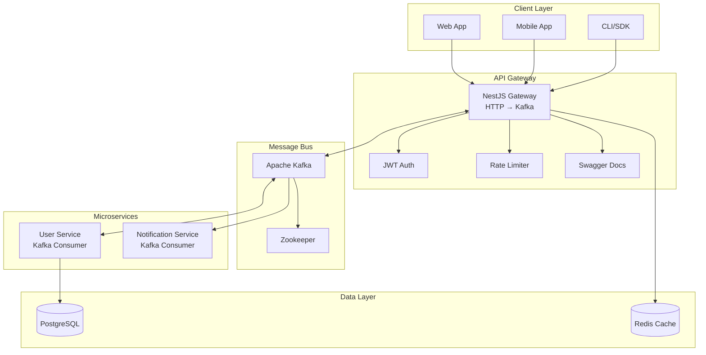
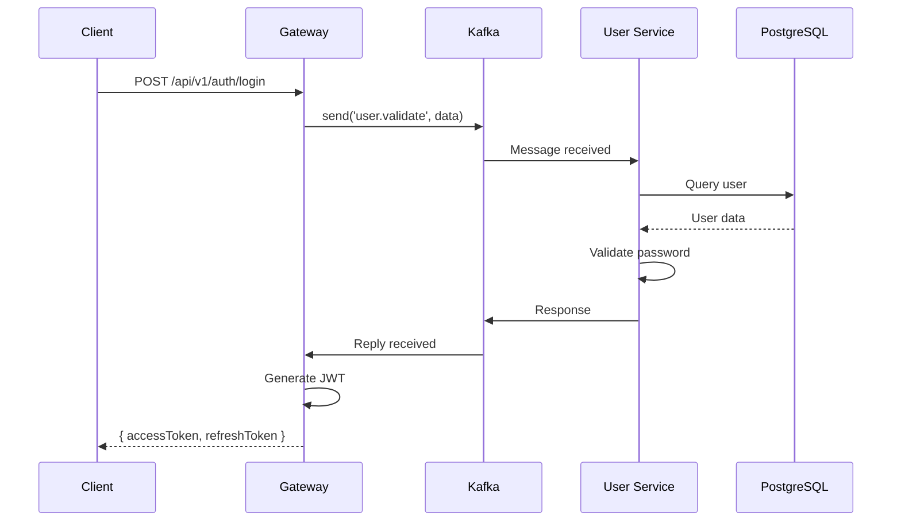
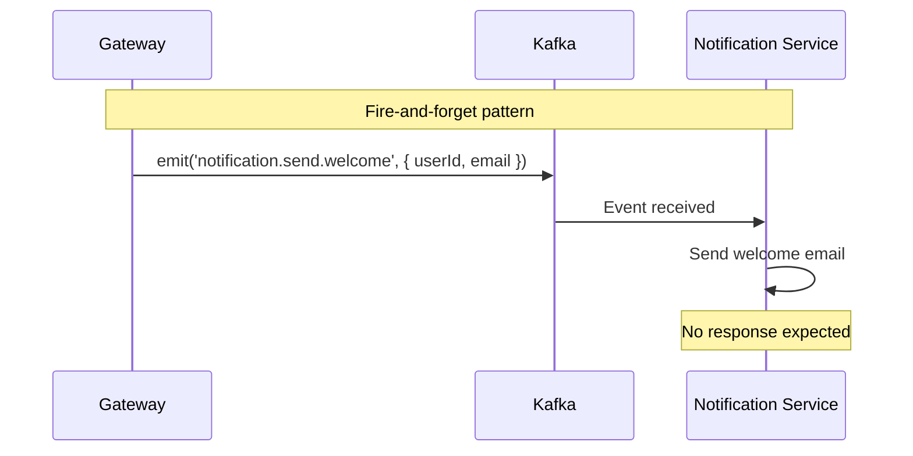
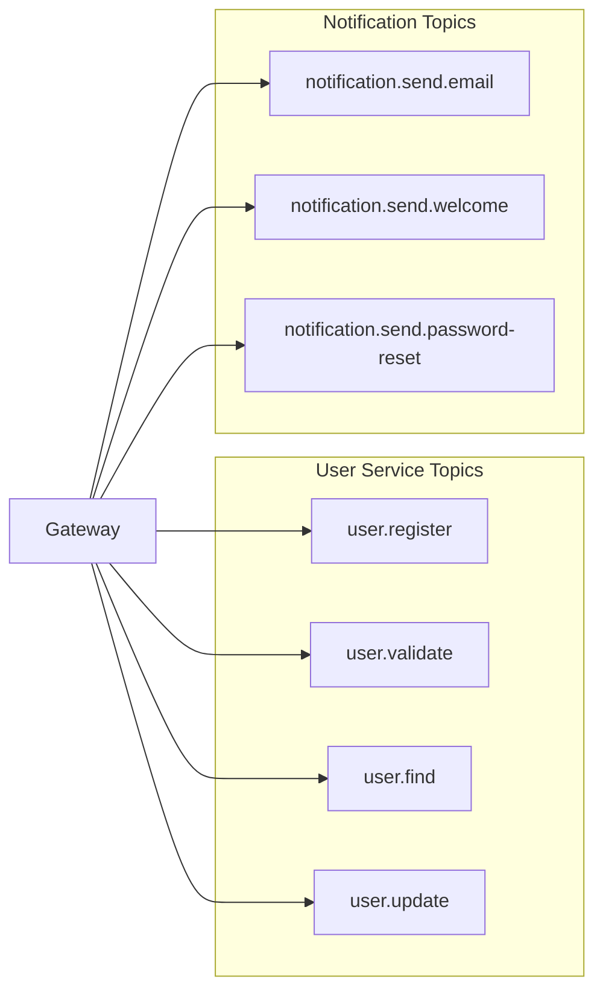
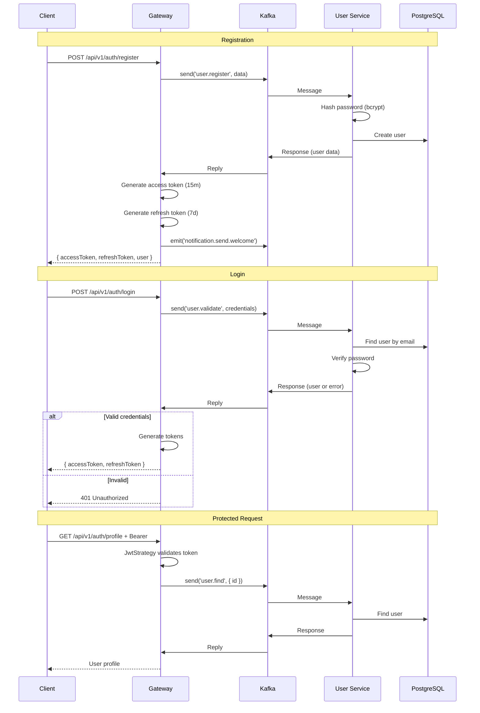
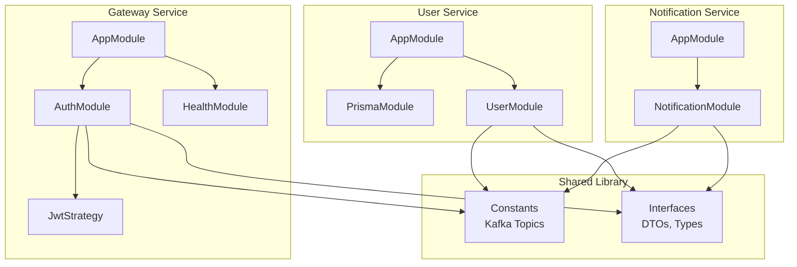
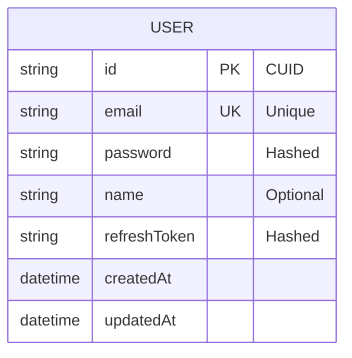
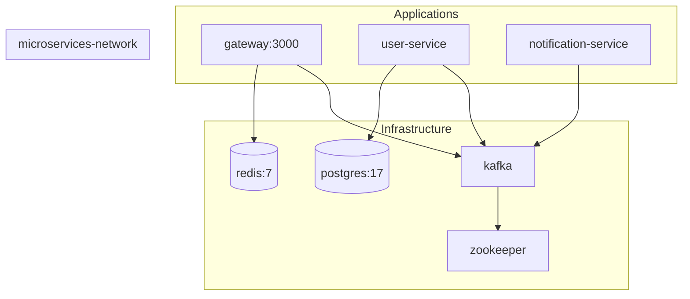
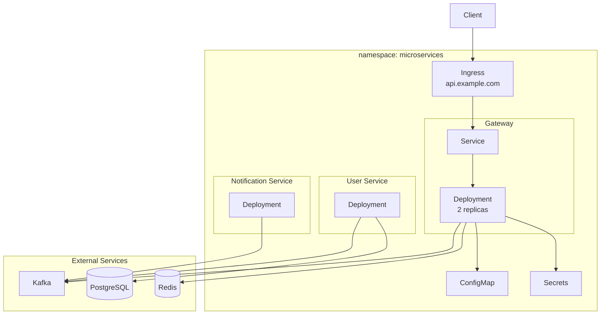

# System Architecture

## High-Level Architecture



## Service Communication Patterns

### Request-Reply Pattern (User Service)



### Event-Driven Pattern (Notifications)



## Kafka Topics



## Authentication Flow



## Service Dependencies



## Database Schema



## Deployment Architecture

### Docker Compose



### Kubernetes



## Component Overview

| Service | Technology | Purpose |
|---------|------------|---------|
| Gateway | NestJS 11 | HTTP API, JWT auth, request routing |
| User Service | NestJS 11 | User CRUD, auth validation |
| Notification Service | NestJS 11 | Email/SMS sending |
| Kafka | kafkajs | Inter-service messaging |
| PostgreSQL 17 | Prisma 6 | User data storage |
| Redis 7 | ioredis | Caching, rate limiting |

## Shared Library

```typescript
// libs/shared/src/constants/index.ts
export const KAFKA_TOPICS = {
  USER: {
    REGISTER: 'user.register',
    LOGIN: 'user.validate',
    FIND_BY_ID: 'user.find',
    UPDATE: 'user.update',
  },
  NOTIFICATION: {
    SEND_EMAIL: 'notification.send.email',
    SEND_WELCOME: 'notification.send.welcome',
    SEND_PASSWORD_RESET: 'notification.send.password-reset',
  },
};

export const SERVICE_NAMES = {
  GATEWAY: 'gateway',
  USER_SERVICE: 'user-service',
  NOTIFICATION_SERVICE: 'notification-service',
};
```

## Security Layers

1. **JWT Authentication** - Gateway validates tokens
2. **Rate Limiting** - ThrottlerGuard (100 req/60s)
3. **bcrypt** - Password hashing in User Service
4. **Hashed Refresh Tokens** - Stored in database
5. **Network Isolation** - Kafka internal communication
