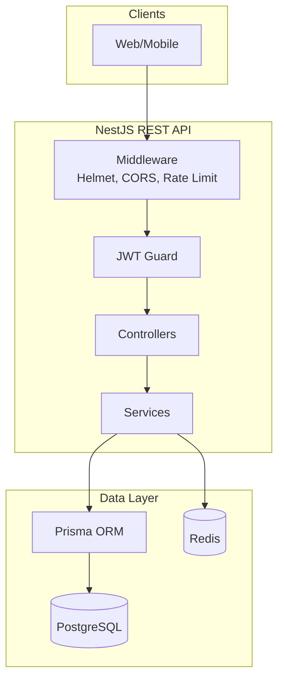
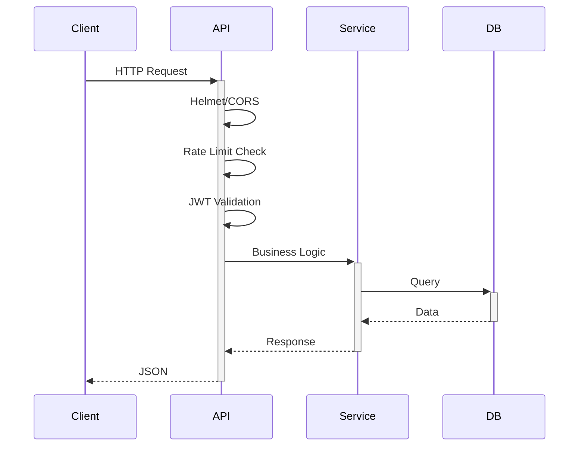
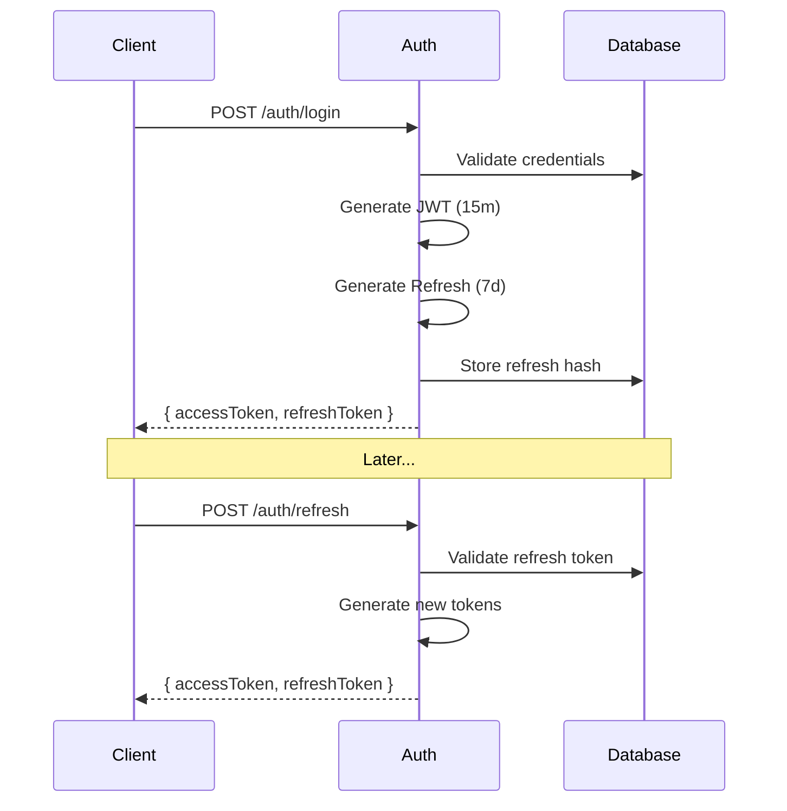
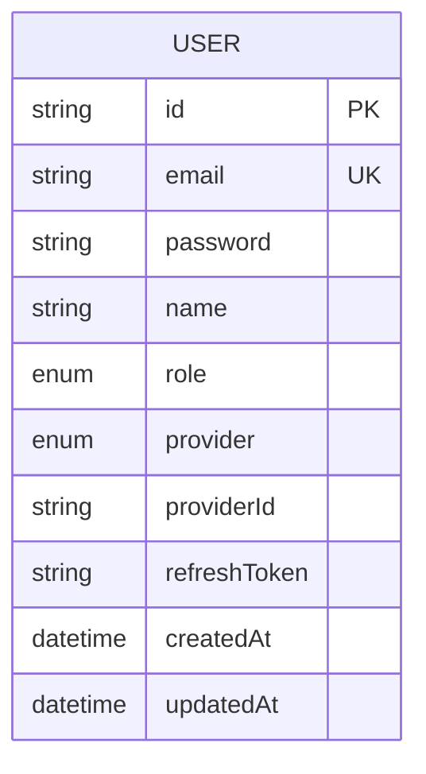

# NestJS REST API Template

Production-ready NestJS REST API with JWT authentication, Prisma ORM, and multi-target deployment.

## Architecture



## Request Flow



## Features

- **NestJS 11** + Node.js 22
- **Auth**: JWT + OAuth2 (Google, GitHub)
- **Database**: PostgreSQL + Prisma ORM
- **Cache**: Redis
- **Security**: Helmet, CORS, rate limiting
- **Docs**: Swagger/OpenAPI
- **Testing**: Vitest + Supertest
- **Deploy**: Docker, K8s, Serverless, PM2

## Quick Start

```bash
pnpm install
cp .env.example .env
pnpm db:generate
pnpm db:migrate
pnpm start:dev
```

API: http://localhost:3000/api/v1/
Swagger: http://localhost:3000/api/docs

## Project Structure

```
src/
├── common/           # Guards, decorators, interceptors
├── config/           # Zod-validated configuration
├── modules/
│   ├── auth/         # JWT + OAuth authentication
│   ├── health/       # Health endpoints
│   └── prisma/       # Database service
├── main.ts           # HTTP entry
└── lambda.ts         # Serverless entry
```

## API Endpoints

| Method | Endpoint | Auth | Description |
|--------|----------|------|-------------|
| POST | /api/v1/auth/register | - | Register user |
| POST | /api/v1/auth/login | - | Login |
| POST | /api/v1/auth/refresh | JWT | Refresh tokens |
| POST | /api/v1/auth/logout | JWT | Logout |
| GET | /api/v1/auth/me | JWT | Current user |
| GET | /api/v1/auth/google | - | Google OAuth |
| GET | /api/v1/auth/github | - | GitHub OAuth |
| GET | /api/v1/health | - | Liveness |
| GET | /api/v1/health/ready | - | Readiness |

## Authentication



## Database Schema



## Deployment

### Docker

```bash
docker build -f docker/Dockerfile -t api .
docker compose up -d
```

### Kubernetes

```bash
kubectl apply -f k8s/
```

### Serverless

```bash
npx serverless deploy
```

### PM2

```bash
pnpm build && pm2 start pm2.ecosystem.config.js
```

## Scripts

```bash
pnpm start:dev     # Dev server
pnpm build         # Production build
pnpm test          # Unit tests
pnpm test:e2e      # E2E tests
pnpm db:migrate    # Run migrations
pnpm db:seed       # Seed database
```

## Documentation

- [System Architecture](./docs/system-architecture.md)
- [Deployment Guide](./docs/deployment-guide.md)

## License

MIT
