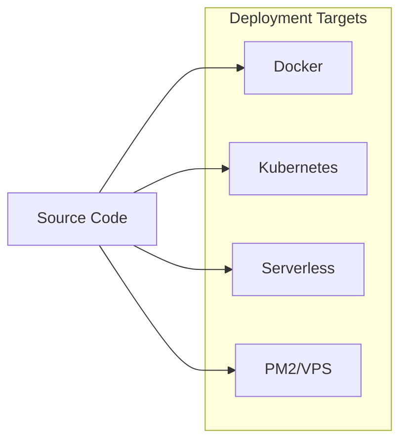
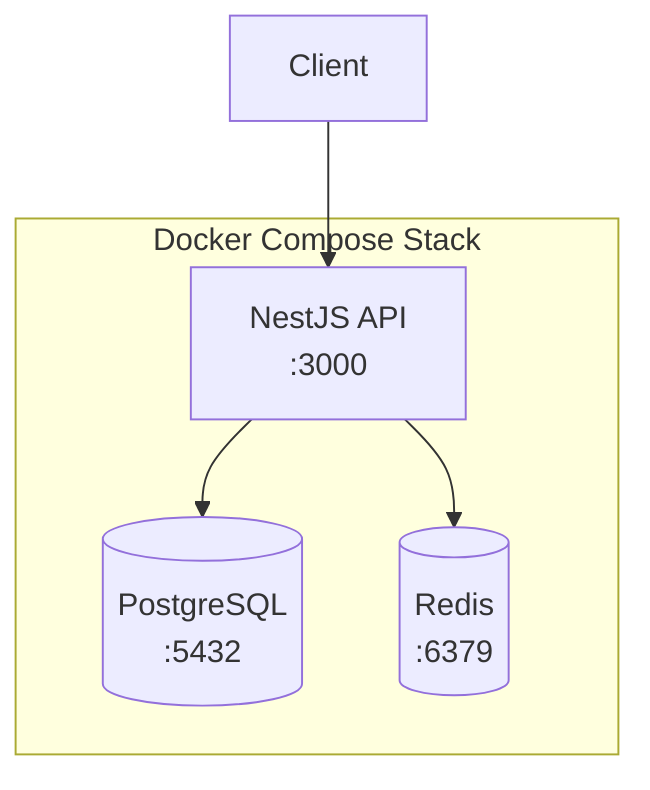
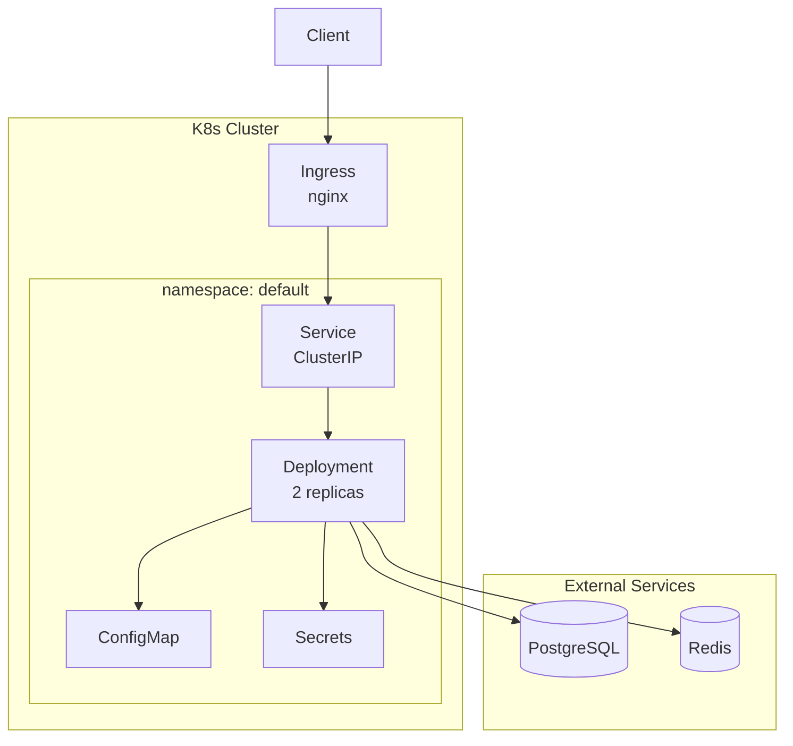
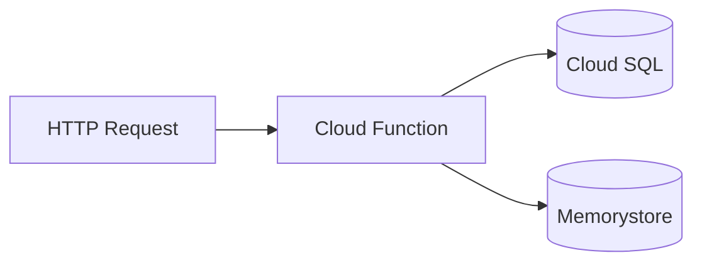
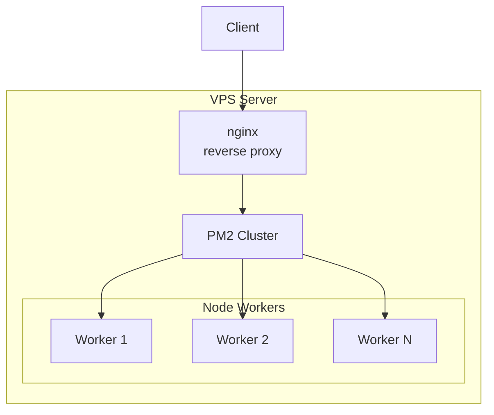
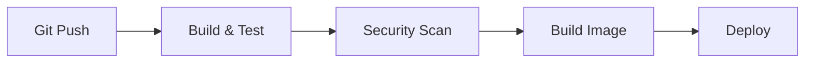

# Deployment Guide

## Deployment Options



## Docker Deployment

### Architecture



### Build & Run

```bash
# Build production image
docker build -f docker/Dockerfile -t nestjs-api .

# Run with docker-compose
docker compose up -d

# View logs
docker compose logs -f api
```

### Dockerfile Stages

| Stage | Purpose |
|-------|---------|
| builder | Install deps, build app |
| production | Copy dist, run as non-root |

## Kubernetes Deployment

### Architecture



### Deploy Commands

```bash
# Apply all manifests
kubectl apply -f k8s/

# Check deployment
kubectl get pods -l app=nestjs-api

# View logs
kubectl logs -l app=nestjs-api -f
```

### Resource Limits

| Resource | Request | Limit |
|----------|---------|-------|
| CPU | 100m | 500m |
| Memory | 128Mi | 512Mi |

### Health Probes

| Probe | Path | Initial | Period |
|-------|------|---------|--------|
| Liveness | /api/health | 30s | 10s |
| Readiness | /api/health/ready | 5s | 5s |

## Serverless Deployment

### Google Cloud Functions



```bash
# Deploy to GCP
npx serverless deploy --stage prod

# Deploy to specific region
npx serverless deploy --stage prod --region us-central1
```

### AWS Lambda

```bash
# Deploy to AWS
npx serverless deploy --stage prod --provider aws
```

## PM2 Deployment (VPS)

### Architecture



### Deploy Commands

```bash
# Build application
pnpm build

# Start with PM2
pm2 start pm2.ecosystem.config.js --env production

# View status
pm2 status

# View logs
pm2 logs
```

### PM2 Configuration

| Setting | Value |
|---------|-------|
| Instances | max (CPU cores) |
| Exec Mode | cluster |
| Max Memory | 512MB |
| Auto Restart | true |

## Environment Variables

| Variable | Required | Description |
|----------|----------|-------------|
| NODE_ENV | Yes | Environment mode |
| PORT | Yes | Server port |
| DATABASE_URL | Yes | PostgreSQL connection |
| REDIS_URL | Yes | Redis connection |
| JWT_ACCESS_SECRET | Yes | JWT signing key |
| JWT_REFRESH_SECRET | Yes | Refresh token key |
| GOOGLE_CLIENT_ID | No | OAuth client |
| GITHUB_CLIENT_ID | No | OAuth client |

## CI/CD Pipeline


