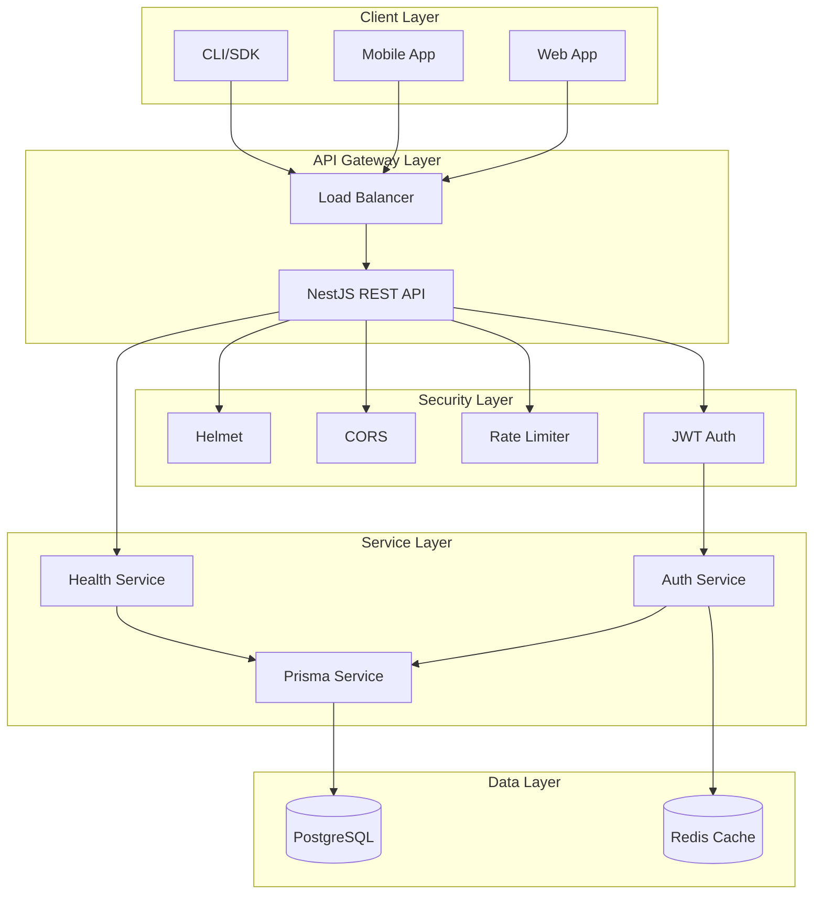
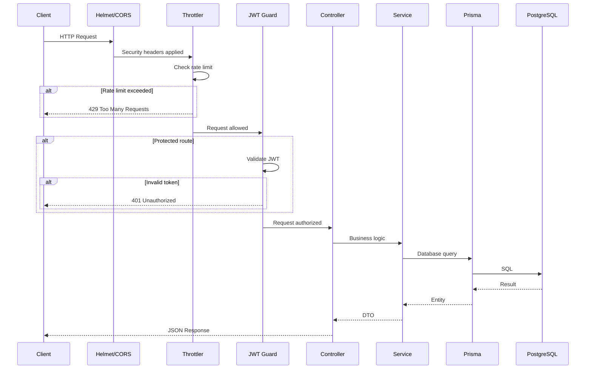
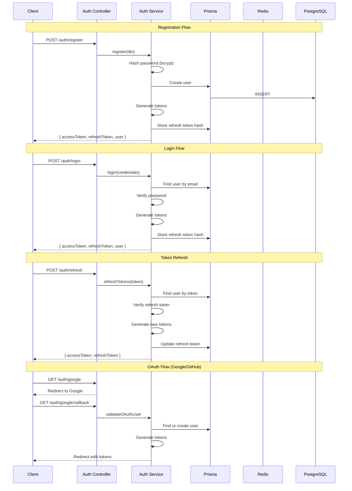
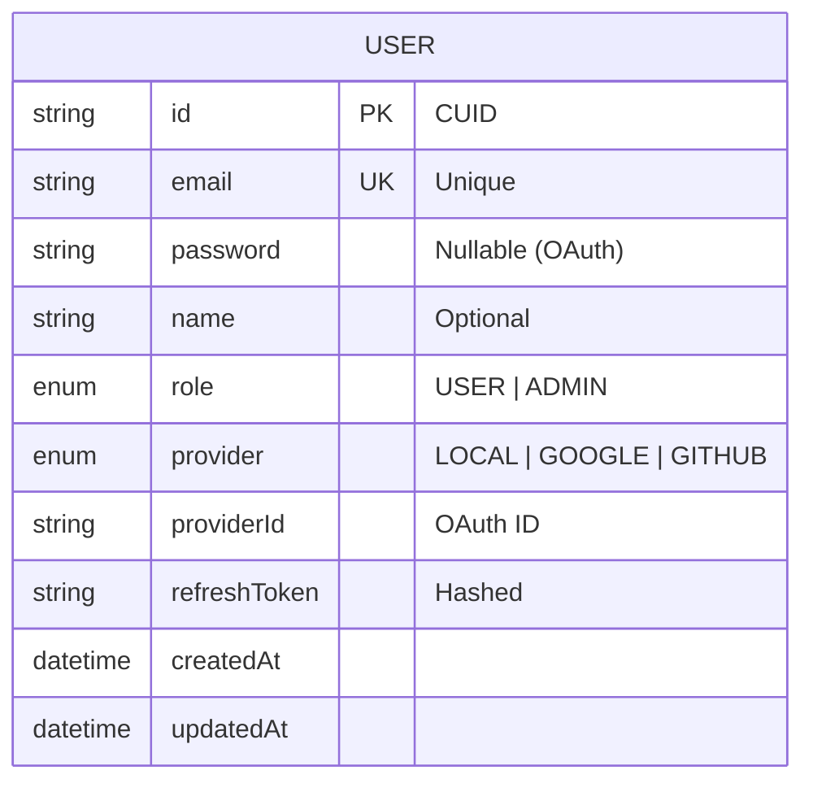
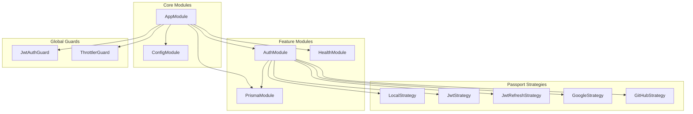
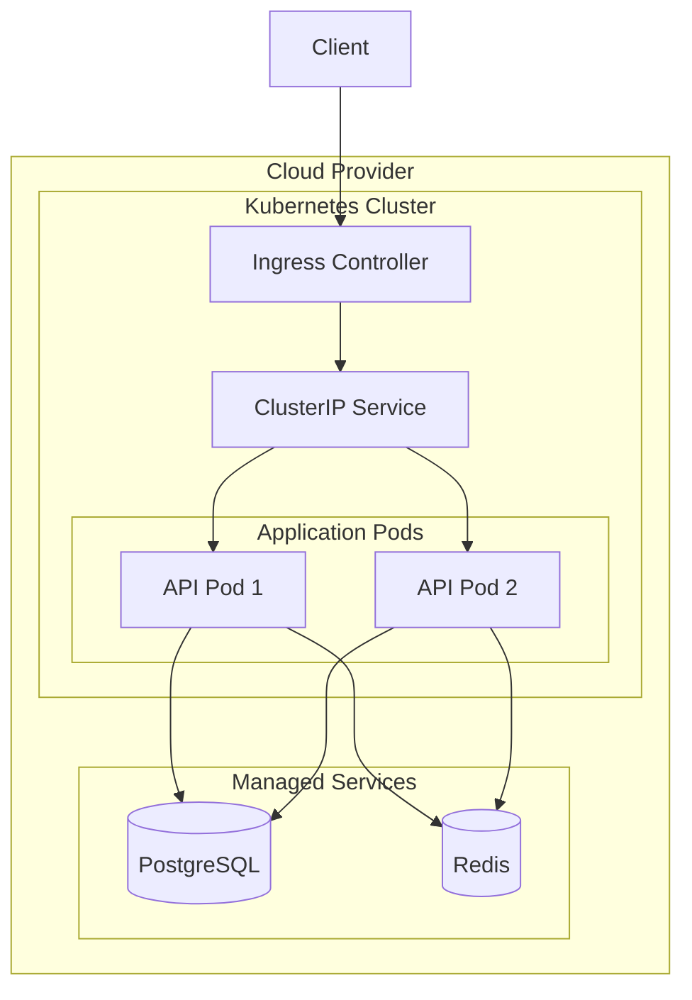

# System Architecture

## High-Level Architecture

## Request Flow

## Authentication Flow

## Database Schema

## Module Dependencies

## Deployment Architecture

## Component Overview

| Component | Technology | Purpose |
|-----------|------------|---------|
| Framework | NestJS 11 | Application framework |
| Runtime | Node.js 22 | JavaScript runtime |
| Database | PostgreSQL 17 | Primary data store |
| ORM | Prisma 6 | Database abstraction |
| Cache | Redis 7 | Session & cache store |
| Auth | Passport.js | Authentication strategies |
| Tokens | JWT | Access & refresh tokens |
| Hashing | bcrypt | Password hashing |
| Validation | class-validator | DTO validation |
| Config | Zod | Environment validation |
| Docs | Swagger | API documentation |
| Testing | Vitest | Unit & E2E tests |

## Security Layers

1. **Helmet** - HTTP security headers
2. **CORS** - Cross-origin resource sharing
3. **Rate Limiting** - 100 req/60s per IP
4. **JWT Auth** - Bearer token authentication
5. **bcrypt** - Password hashing (10 rounds)
6. **Validation** - Input sanitization
